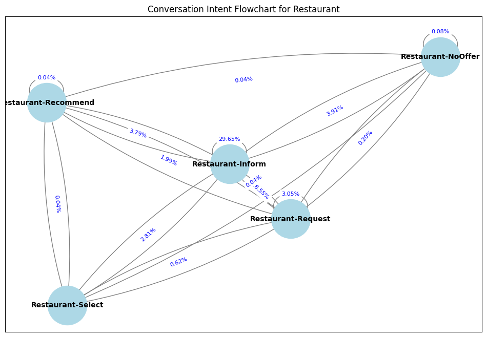

# [Calculating Conversation Quality](https://interesting-wildflower-0cf.notion.site/Case-Valence-ML-AI-Data-Science-10c2531f31768016823ae32a9a7e5cef?pvs=27&qid=)


This repository contains scripts and data to preprocess, analyze, and evaluate the quality of task-oriented conversations, with a focus on MultiWOZ.

## Summary
* Preprocess:```0_preprocess.py```
* Feature Engineering: ```1_feature_eng.py```
* **Starter: Basic ML method for satisfaction prediction:** ```1A_NonLLM_Intent_and_Satisfaction.ipynb```
* Convo level analysis: ```1B_NonLLM_Convo_Satisfaction.ipynb ```
* **Core: LLM method for satisfaction prediction:** 

## Folder Structure

    ├── data/                                           # Directory for storing raw and processed data
    │   ├── raw/                                        # Original data files (e.g. MultiWOZ dataset)
    │   ├── output/                                     # Processed files and analysis results
    ├── myenv/                                          # Environment setup for replicating the development environment
    ├── src/                                            # Source code for preprocessing and analysis
    │   ├── utils.py                                    # Helper functions, mostly used in Python scripts
    │   ├── 0_preprocess.py                             # Python script automating preprocessing steps from 1.ipynb
    │   ├── 0_Preprocess_EDA.ipynb                      # NB for preprocessing and exploratory data analysis (EDA)
    │   ├── 1A_NonLLM_Intent_and_Satisfaction.ipynb     # NB for analyzing intent/satisfaction metrics without LLMs
    │   ├── 1B_NonLLM_Convo_Satisfaction.ipynb          # NB for convo level satisfaction without LLMs
    │   ├── 1_feature_eng.py                            # Python script automating preprocessing steps from 1A.ipynb
    │   ├── career_coaching_sunburst.html               # Example plotly convo intelligence dashboard
    ├── README.md                                       # Documentation for the project
    ├── requirements.txt                                # List of Python dependencies

## Running Code

  ```bash
  python src/0_preprocess.py
  python src/1_feature_eng.py
```
Setup Env + Install dependencies using:
  ```bash
  python -m venv myvenv
  source myenv/bin/activate
  source /Users/RiRi/Desktop/github/convo-quality/myenv/bin/activate
  pip install -r requirements.txt
```

## Example EDA Visuals
generated in ```1B_NonLLM_Convo_Satisfaction.ipynb```
